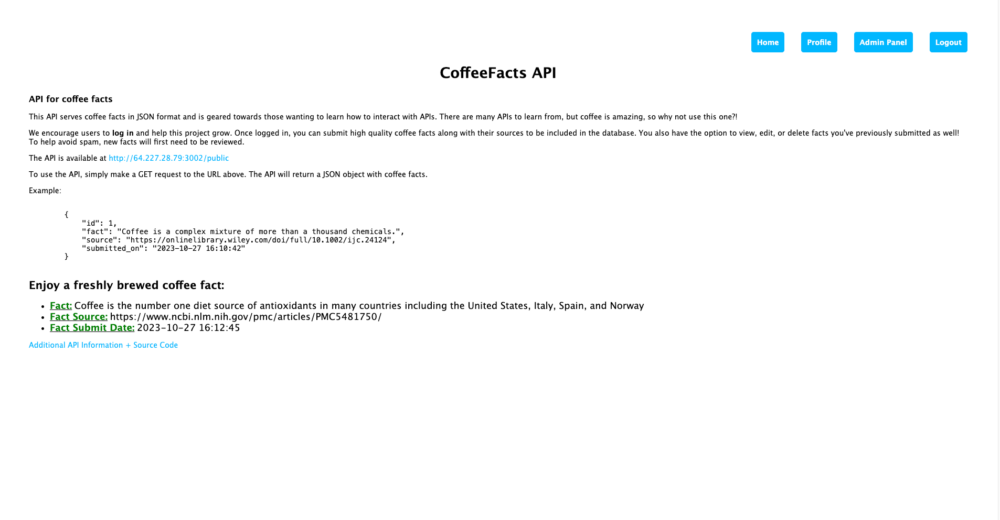
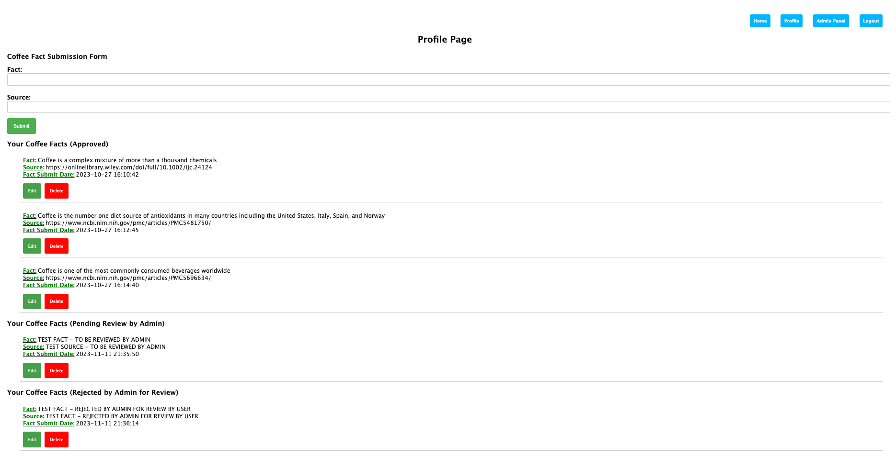
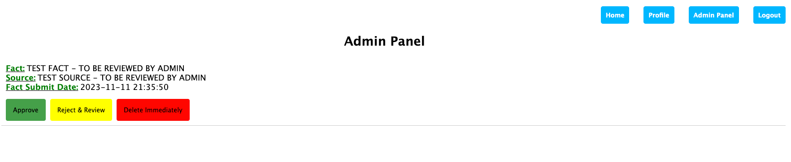

# Coffee-Facts-API

Welcome to Coffee Facts API! This project is for anyone looking to learn about interacting with APIs, creating routes,
or, for those who love coffee, that amazing energizing elixir, to borrow a term from [Boston Dynamic's Spot the Dog with
Nature Documentary personality](https://youtu.be/djzOBZUFzTw?si=7GcjxQoGOI_IjBnP&t=438). Whether you're into coding or
want to help the project grow by contributing to the codebase or high-quality facts and their sources by logging into
the site, you're in the right place!

This is the frontend repository. The backend repository is located
at [Coffee Facts API Backend](https://github.com/iamericfletcher/CoffeeFactsDBAPI).

## Tech Stack

- **Authentication**: OAuth 2.0, express-oauth2-jwt-bearer
- **Backend**: Node.js with Express
- **Database**: SQLite3 - currently hosted on DigitalOcean Droplet
- **Deployment**: GitHub and DigitalOcean App Platform
- **Frontend**: Express with EJS templates, Axios to communicate with the backend
- **Process Management**: PM2
- **Rate Limiting**: Express Rate Limit

## Rate Limiting
The API has a rate-limit of 100 requests per 15 minutes per IP.

## Middleware
- `limiter`: Handles rate limiting.
- `isAdmin`: Checks if the logged-in user is an admin.
- `countRoutes`: Counts the number of backend routes hit by the user.

## UserFlow
- User logs in with Auth0.
- User is redirected to the homepage.
- User can view a random coffee fact on the homepage.
- User can view their profile.
- User can add a new coffee fact from their profile.
- User can edit or delete coffee facts they've previously submitted from their profile page.
- User can edit or delete coffee facts they've submitted but not yet reviewed by an admin from their profile page.
- Admin can view admin panel.
- Admin can view all unapproved facts from the admin panel.
- Admin can approve or reject a pending fact from the admin panel.

## Database Schema

### `coffee_facts` Table - PUBLIC ROUTE

| Column         | Data Type | Description                  |
|----------------|-----------|------------------------------|
| `id`           | INTEGER   | Auto-incremented primary key |
| `fact`         | TEXT      | The coffee fact text         |
| `source`       | TEXT      | Source of the fact           |
| `submitted_on` | DATETIME  | Timestamp of the submission  |

### `coffee_facts` Table - PRIVATE ROUTE
| Column                         | Data Type | Description                               |
|--------------------------------|-----------|-------------------------------------------|
| `id`                           | INTEGER   | Auto-incremented primary key              |
| `fact`                         | TEXT      | The coffee fact text                      |
| `source`                       | TEXT      | Source of the fact                        |
| `user_id`                      | TEXT      | Auth0 user sub identifier                 |
| `submitted_on`                 | DATETIME  | Timestamp of the fact submission          |
| `is_approved`                  | INTEGER   | Approval status (0: Pending, 1: Approved) |
| `admin_approved_on`            | DATETIME  | Timestamp of admin approval               |
| `admin_rejected_for_review_on` | DATETIME  | Timestamp of admin rejection for review   |
| `last_user_edit_on`            | DATETIME  | Timestamp of the last user edit           |

#### *Auth0 User Sub Identifier

- Subject Identifier. A locally unique and never reassigned identifier within the Issuer for the End-User, which is
  intended to be consumed by the Client, e.g., 24400320 or AItOawmwtWwcT0k51BayewNvutrJUqsvl6qs7A4.
  - https://auth0.com/docs/secure/tokens
  - https://openid.net/specs/openid-connect-core-1_0.html#StandardClaims

## API

### Overview

Built with **Express**, **SQLite3**, **Auth0 JWT**, and **express-oauth2-jwt-bearer**. Security measures include JWT
checks on all routes except `/public`.

### CoffeeFactsDBAPI Endpoints (Backend)

Built with Express and SQLite3 to handle database interactions.

#### `GET /public`
- Fetches all public coffee facts.
- 🛡️ No authentication needed

#### `GET /private`
- Fetches all facts, including Auth0 `user_id`.
- 🛡️ JWT Check

#### `GET /unapprovedFacts`
- Fetches all unapproved facts for display in the admin panel.
- 🛡️ JWT Check

#### `PUT /adminApproveFact/:id`
- Approves a pending fact and adds it to the public facts.
- 🛡️ JWT Check

#### `DELETE /adminRejectFact/:id`
- Rejects a pending fact and removes it from the database.
- 🛡️ JWT Check

#### Other CRUD Endpoints

#### `POST /addFact`
- Adds a new coffee fact to the database.
- 🛡️ JWT Check

#### `PUT /editFact/:id`
- Updates a specific fact in the database.
- 🛡️ JWT Check

#### `DELETE /deleteFact/:id`
- Deletes a specific fact from the database.
- 🛡️ JWT Check

### CoffeeFacts Endpoints (Frontend)

Built with `Express` and `Axios` to communicate with the backend where the database interactions take place.

#### `GET /`
- Renders the homepage and shows a random coffee fact.
- The random fact for display on the homepage are from facts that have been approved by an admin.
- 🛡️ No authentication needed

#### `GET /userProfile`
- Renders the user profile page and shows all facts submitted by the logged-in user (approved and pending facts).
- 🛡️ Requires Auth

#### `GET /editFact/:id` & `POST /editFact/:id`
- Renders the edit fact page and allows the user to edit a specific fact and submit the changes.
- Fields in the edit fact page are pre-populated with the existing fact and source.
- 🛡️ Requires Auth

#### `POST /submit`
- Submits a new coffee fact to the database and redirects to the user profile page.
- New facts are pending until an admin approves them.
- 🛡️ Requires Auth

#### `POST /deleteFact/:id`
- Deletes a specific fact from the database.
- 🛡️ Requires Auth

#### `GET /adminPanel`
- Renders the admin panel page and shows all unapproved facts.
- Each unapproved fact has an approval and reject button.
- - 🛡️ Requires Auth

#### `POST /adminApproveFact/:id`
- Admin-only route to approve a pending fact and add it to the public facts.
- Redirects back to the admin panel page.
- - 🛡️ Requires Auth

#### `POST /adminRejectFact/:id`
- Admin-only route to reject a pending fact and remove it from the database.
- Redirects back to the admin panel page.
- - 🛡️ Requires Auth

## Contributing

- Open issues or PRs anytime!
- Log in to the website to contribute new high-quality coffee facts and sources.

## References

- [Auth0](https://auth0.com)
- [OAuth2 JWT Bearer GitHub](https://github.com/auth0/express-oauth2-jwt-bearer)
- [Express and Authentication Series using Auth0](https://www.youtube.com/playlist?list=PLshTZo9V1-aGzE7xMaQrCUOQ-R-8A7Jzq)

## Screen Shots
### Homepage

### Profile

### Admin Panel

